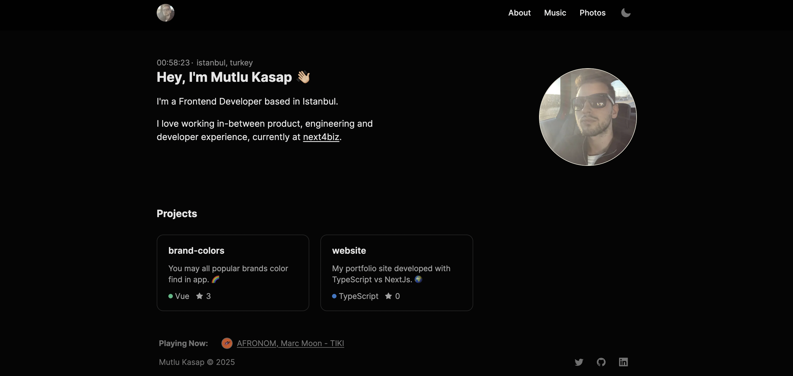

# Personal Portfolio Website

This is a **personal portfolio website** built with **Next.js**, **Tailwind CSS**, and **TypeScript**. It showcases my projects, skills, and background as a developer.

---

## 🚀 Technologies Used

- **Next.js** – React framework for production
- **Tailwind CSS** – Utility-first CSS framework
- **TypeScript** – Strongly typed JavaScript
- **Yarn** – Dependency management

---

## 🖼️ Demo Screenshot



---

## 📦 Installation

```bash
# Clone the repository
git clone https://github.com/mutluksap/website.git

# Navigate to the project folder
cd website

# Install dependencies
yarn install

# Run the development server
yarn dev
